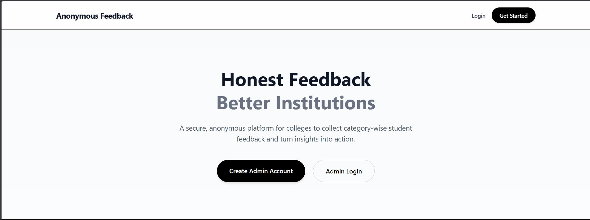
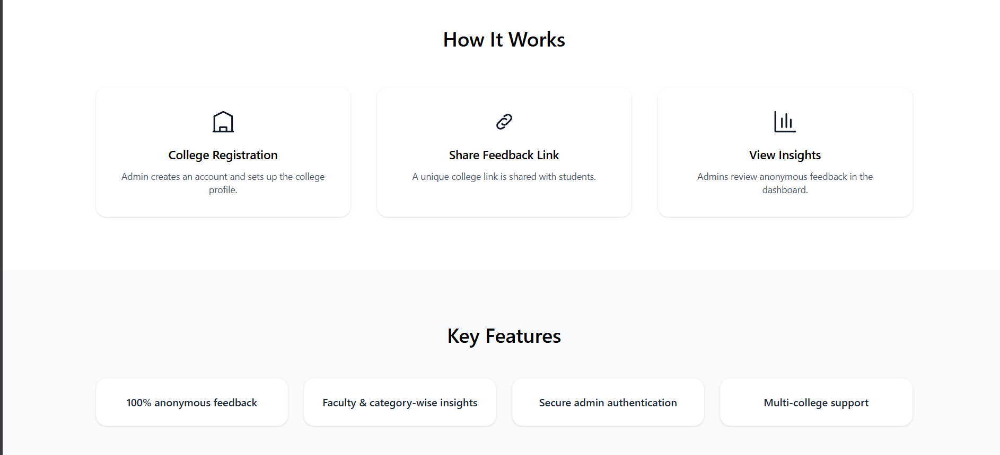
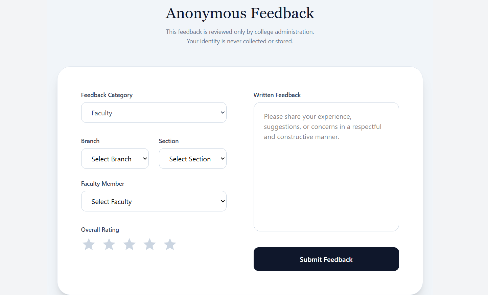
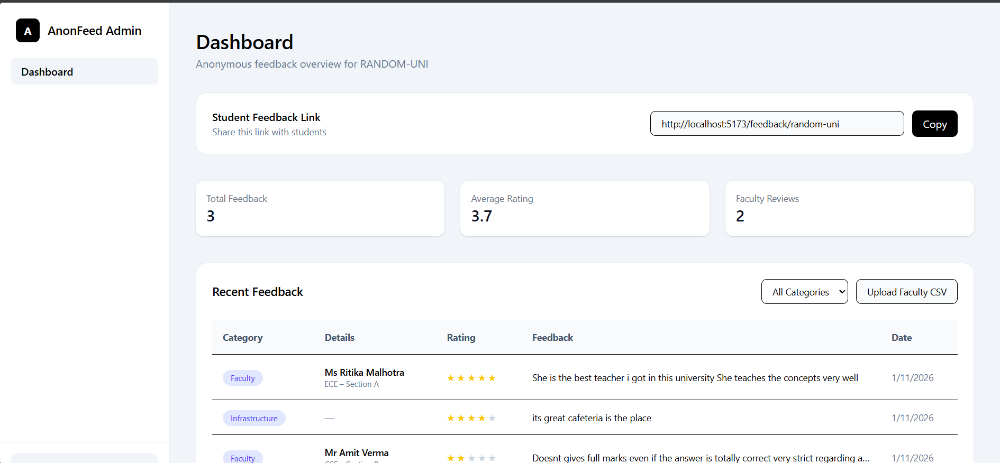
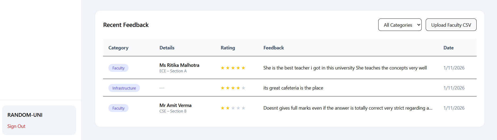
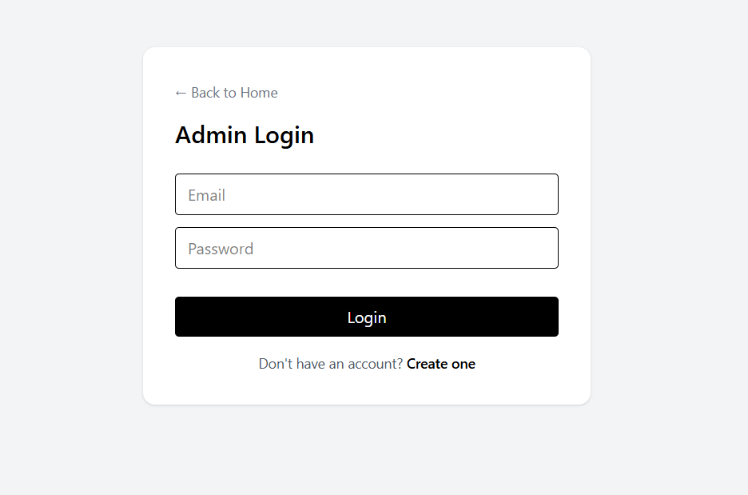
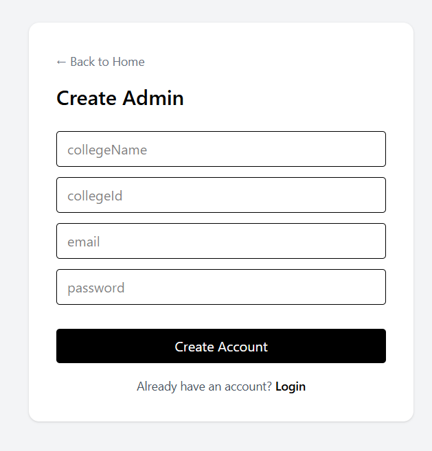

# Anonymous Feedback Platform (MERN)

An end-to-end **full-stack anonymous feedback web application** built using the **MERN stack**.  
It allows users to submit feedback anonymously while admins can securely view and manage feedback through a dashboard.

---

## 🛠 Tech Stack

### Frontend
- React (Vite)
- Tailwind CSS
- JavaScript

### Backend
- Node.js
- Express.js
- MongoDB
- REST API

---

## ✨ Features
- Anonymous feedback submission
- Admin dashboard for viewing feedback
- Secure backend APIs
- Responsive UI (mobile-friendly)
- Clean and modular code structure

---

## ⚙️ Installation & Setup

### 1️⃣ Clone the repository
```bash
git clone https://github.com/pratik-pritam-rout/Anonymous-Feedback-Platform.git
cd Anonymous-Feedback-Platform
```
### 2️⃣ Backend Setup
```
cd anon-feedback-server
npm install
npm run dev
```

Create a .env file inside anon-feedback-server:
```
MONGO_URI=your_mongodb_connection_string
PORT=5000
```

3️⃣ Frontend Setup
```
cd anon-feedback-client
npm install
npm run dev
```

## 📸 Screenshots

### Home Page




### Feedback Form


### Admin Dashboard



### Login Page


### Signup Page



🙋‍♂️ Author

Pratik Pritam Rout
GitHub: https://github.com/pratik-pritam-rout
